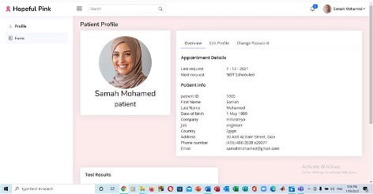
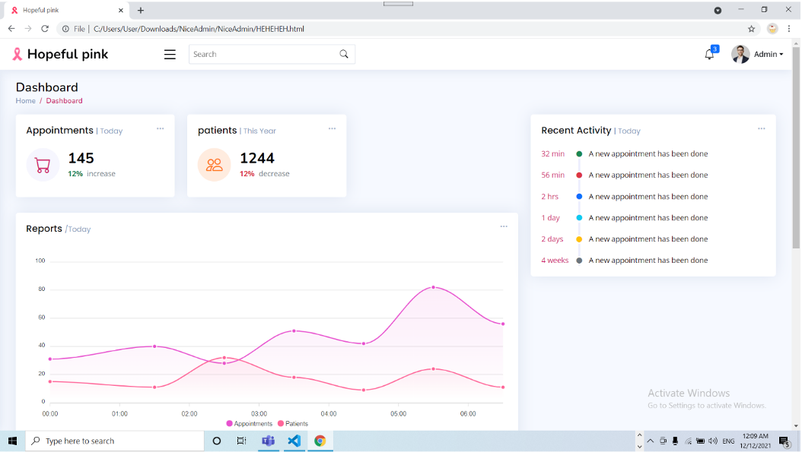

# HopefulPink (breast cancer website for booking appointments) 
Breast cancer is sometimes found after symptoms appear, but many women with breast cancer have no symptoms.  
Therefore, early breast cancer screening is so important.  
The goal of screening is to catch cancers early.  
Early-stage cancers are easier to treat than later-stage cancers, and the chance of survival is higher.  

 Therefore, we built a checkup system that receives women’s information and appoint them appointments for them for breast cancer checkup/screening. 
Upon several questions, the patient’s case is determined whether is urgent or not.  

**Implementation:**  
Our system has a front end implemented with HTML, CSS, Bootstrap, JS and the backend implemented with Node JS, MySQL(Database). 

**3 Zip folders:**  archive 1 and 2 for frontend , backend.zip for form backend  
Home folder: home and signup page 
Patient folder: Patient view pages 
doctor folder: doctor view pages 
Admin folder: admin view pages  
 
**Screenshots**  
**Home and signup page** 
 
 
 **patient** 
 
 
 **Admin** 
 
 **Doctor** 
 
